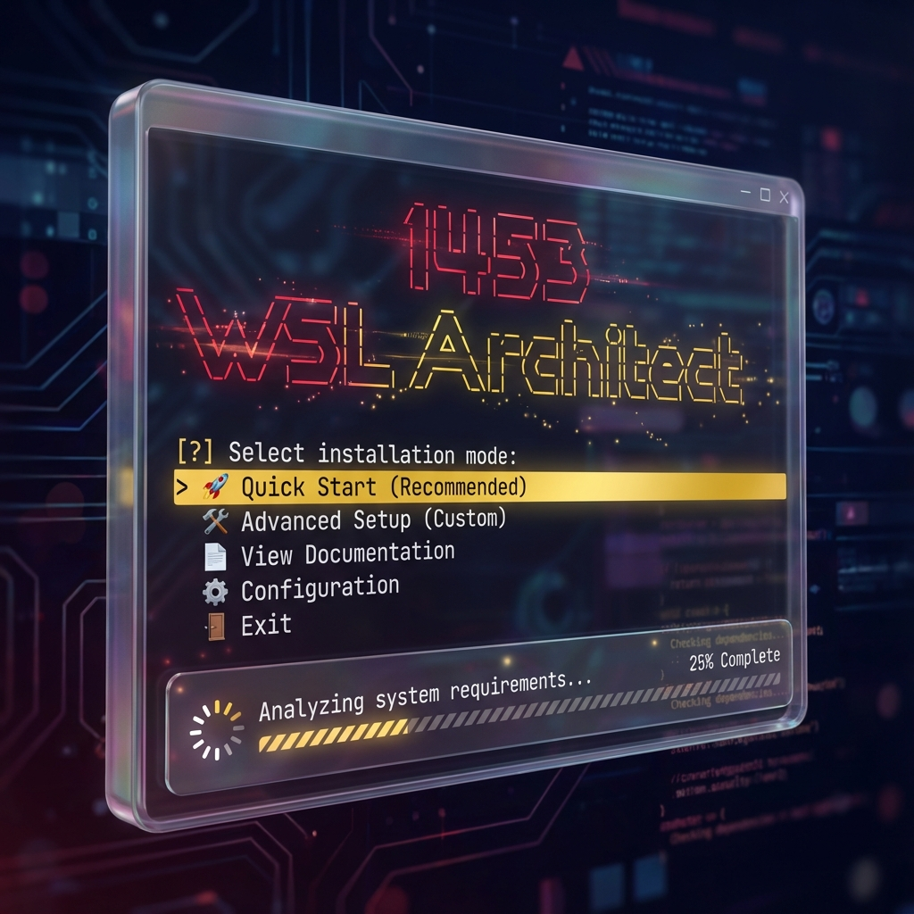

# 🚀 1453 WSL Architect



[](https://opensource.org/licenses/MIT)
[](https://www.gnu.org/software/bash/)
[](https://docs.microsoft.com/en-us/windows/wsl/)
[](https://github.com/ravidulundu/1453-wsl-bash-script/releases)
[](https://github.com/ravidulundu/1453-wsl-bash-script)

**AI destekli, modern ve estetik: Windows Subsystem for Linux (WSL) ve Linux ortamınızı tek komutla bir sanat eserine dönüştürün.**

1453 WSL Architect, sıradan bir kurulum scripti değildir. O, geliştirme ortamınızı **Crimson & Gold** temasıyla süsleyen, yapay zeka destekli etkileşimler sunan ve **40+ modern aracı** otomatik yapılandıran akıllı bir asistandır.

---

## 📊 Hızlı Bakış

| Kategori | İçerik |
|----------|---------|
| **Versiyon** | v2.5.0 (2025-11-24) |
| **Durum** | ✅ Production-Ready |
| **Tema** | 🎨 Crimson (#DC143C) & Gold (#FFD700) |
| **UX** | 🤖 AI-Like (Streaming Text, Thinking States) |
| **Mimari** | 📦 Modüler (25 dosya, 9000+ satır) |
| **Diller** | Python, JavaScript, PHP, Go |
| **Araçlar** | 40+ geliştirme aracı |
| **AI** | 8 CLI + 3 Framework |
| **Platform** | WSL2 + Linux (APT/DNF/YUM/Pacman) |
| **Arayüz** | 🎨 Modern TUI (Charm Gum) |
| **Dil** | 🇹🇷 Tam Türkçe |

---

## ✨ Öne Çıkan Özellikler

### 🤖 AI Destekli Kullanıcı Deneyimi (YENİ!)
- **Streaming Text:** Tüm metinler daktilo efektiyle akar, canlı bir asistan hissi verir.
- **Thinking States:** Uzun işlemler sırasında "Analiz ediliyor...", "İnşa ediliyor..." gibi akıllı durum bildirimleri.
- **Zero-Echo Policy:** Ham terminal çıktıları yok! Her şey modern Gum bileşenleri ve spinner'lar arkasında.

### 🎨 Premium Tasarım (YENİ!)
- **Crimson & Gold:** Osmanlı kırmızısı ve altınıyla tasarlanmış özel renk paleti.
- **Modern TUI:** Charm Gum framework ile profesyonel, interaktif menüler ve formlar.
- **Görsel Bütünlük:** Hata mesajlarından başarı bildirimlerine kadar her şey tutarlı.

### ⚡ Performans ve Stabilite (YENİ!)
- **GitHub API Rate Limit Fix:** Akıllı önbellekleme (caching) ve auth desteği ile API limitlerine takılmadan sınırsız kurulum.
- **Bootstrapping:** Kurulumun ilk saniyesinden itibaren modern arayüz.
- **Akıllı Hata Yönetimi:** Hata durumunda "Logları Göster", "Tekrar Dene" veya "Atla" seçenekleri.

### 🛠️ Programlama Dilleri ve Araçlar

#### 🐍 Python Ekosistemi
- **Python 3.x** + **pip** (PEP 668 uyumlu)
- **pipx** - İzole Python uygulamaları
- **UV** - Ultra-hızlı paket yöneticisi

#### 🟨 JavaScript/TypeScript
- **NVM** - Node Version Manager
- **Node.js LTS** - Otomatik kurulum
- **Bun.js** - Modern JavaScript runtime

#### 🐘 PHP Ekosistemi
- **PHP 7.4 → 8.5** - Çoklu versiyon desteği
- **12 Extension** - Laravel-ready
- **Composer** - SHA384 doğrulamalı

#### 🐹 Go Language
- **Latest Stable** - GOPATH otomatik yapılandırma

#### 🐋 Docker
- **Docker Engine** + **Docker Compose**
- **lazydocker** - Terminal UI

### ⚡ Modern CLI Araçları (12 Araç)

| Araç | Açıklama | Yerine Geçtiği |
|------|----------|----------------|
| **bat** | Syntax highlighting'li cat | `cat` |
| **eza** | Modern ls (ikon + git) | `ls` |
| **ripgrep** | Çok hızlı grep | `grep` |
| **fd** | Basit ve hızlı find | `find` |
| **tree** | Dizin ağacı görüntüleyici | - |
| **starship** | Cross-shell prompt | PS1 |
| **zoxide** | Akıllı cd (AI-powered) | `cd` |
| **fzf** | Fuzzy finder | - |
| **vivid** | LS_COLORS generator | - |
| **fastfetch** | Sistem bilgisi | `neofetch` |
| **lazygit** | Terminal Git TUI | - |
| **lazydocker** | Terminal Docker TUI | - |

---

## 🚀 Kurulum

### Tek Satır Kurulum (Önerilen)

```bash
# curl ile (önerilen)
bash <(curl -fsSL https://raw.githubusercontent.com/ravidulundu/1453-wsl-bash-script/master/install.sh)

# veya wget ile
bash <(wget -qO- https://raw.githubusercontent.com/ravidulundu/1453-wsl-bash-script/master/install.sh)
```

**Kurulum ne yapar:**
1. ✅ Charm Gum TUI framework'ünü yükler (anında modern arayüz).
2. ✅ 25 modüler dosyayı GitHub'dan indirir.
3. ✅ `~/.1453-wsl-setup/` dizini oluşturur.
4. ✅ Başlatıcı script hazırlar (`1453-setup`).

### Kurulum Sonrası Dizin Yapısı

```
~/.1453-wsl-setup/
├── 1453-setup                    # Başlatıcı script
├── templates/
│   └── starship.toml             # Starship config
└── src/
    ├── linux-ai-setup-script.sh  # Ana script
    ├── lib/                      # Core libraries
    │   ├── ai-text.sh            # ✨ AI Text Effects
    │   ├── gum-init.sh           # ✨ Gum Wrappers
    │   ├── theme.sh              # ✨ Crimson/Gold Theme
    │   ├── common.sh             # Utilities
    │   ├── package-manager.sh    # Package Manager
    │   └── ...
    ├── config/                   # Configuration
    │   ├── tool-versions.sh      # ✨ Smart Version Caching
    │   └── ...
    └── modules/                  # Feature modules
        ├── shell-setup.sh        # ✨ Refactored
        ├── quickstart.sh         # ✨ Refactored
        └── ...
```

---

## 📖 Kullanım Kılavuzu

### 1️⃣ Hızlı Başlangıç Modu
Ana menüden **"🚀 Hızlı Başlangıç (Önerilen)"** seçeneğini seçin.
*   **5 Hazır Paket:** Web, AI, Backend, Full Stack, Mobile.
*   **Tam Otomatik:** Arkanıza yaslanın ve AI asistanın kurulumu yapmasını izleyin.

### 2️⃣ Gelişmiş Mod
Ana menüden **"🛠️ Gelişmiş Mod"** seçeneğini seçin.
*   **Tam Kontrol:** Hangi aracın kurulacağını tek tek seçin.
*   **Detaylı Ayarlar:** Sistem, dil ve araç bazlı özelleştirme.

---

## 🔄 Versiyon Geçmişi

### v2.5.0 (2025-11-24) - 🤖 AI & UX Devrimi
- **✨ AI Experience:** Typewriter effect, thinking states, streaming text eklendi.
- **🎨 Crimson & Gold:** Tüm arayüz yeni premium temaya geçirildi.
- **⚡ Rate Limit Fix:** GitHub API istekleri için akıllı önbellekleme ve auth desteği.
- **🚀 Bootstrapping:** Kurulumun ilk anından itibaren Gum arayüzü.
- **🧹 Refactor:** Tüm modüller `echo`'dan arındırıldı, %100 Gum entegrasyonu.

### v2.4.0 (2025-11-23) - GitHub Otomasyon
- 🆕 GitHub otomasyon fonksiyonları (ghnew, ghpush, ghclone).
- 🆕 Gelişmiş navigasyon alias'ları.

---

## 👨‍💻 Geliştirici

**Ravid Ulundu** - [@ravidulundu](https://github.com/ravidulundu)

**Proje Linki:** [https://github.com/ravidulundu/1453-wsl-bash-script](https://github.com/ravidulundu/1453-wsl-bash-script)

---

**⭐ Projeyi beğendiyseniz yıldız vermeyi unutmayın!**
