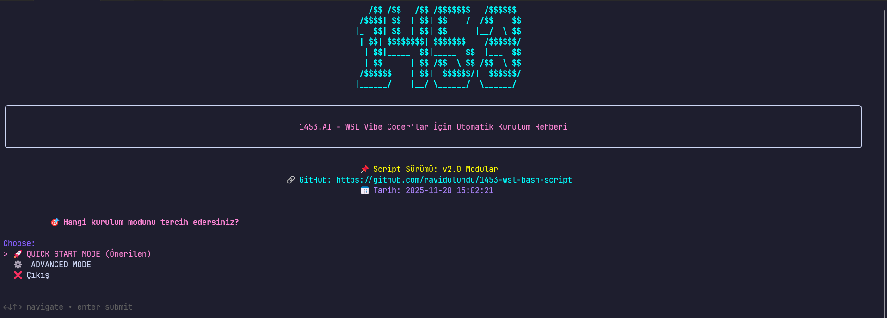

# 1453 WSL Kurulum Scripti

[](https://opensource.org/licenses/MIT)
[](https://www.gnu.org/software/bash/)
[](https://docs.microsoft.com/en-us/windows/wsl/)

WSL için AI geliştiricilere özel, tam Türkçe arayüzlü, modüler kurulum scripti. Tek satırda tüm geliştirme ortamınızı hazırlayın.



**Versiyon**: 2.3.2 (2025-11-20)

---

## 🎯 Özellikler

### Kurulum
- ✅ **Tek Satır Kurulum** - curl/wget ile anında başlat
- ✅ **Modüler Mimari** - 23 dosyaya ayrılmış temiz yapı
- ✅ **Modern TUI** - Gum framework ile profesyonel arayüz
- ✅ **Responsive** - Terminal genişliğine göre otomatik düzen
- ✅ **İki Mod** - Hızlı Başlangıç (yeni başlayanlar) + Gelişmiş (detaylı kontrol)

### Güvenlik
- ✅ **Güvenli Kod** - Tüm command injection bug'ları düzeltildi
- ✅ **SHA256 Doğrulama** - Binary dosyaların güvenliği kontrol edilir
- ✅ **Tek Sudo** - Bir kez şifre gir, tüm kurulum boyunca kullan

### Dil ve Araçlar
- 🐍 **Python** - Python 3, pip, pipx, UV
- 🟨 **JavaScript** - NVM, Node.js, Bun.js
- 🐘 **PHP** - PHP 7.4-8.5, Composer, Laravel desteği
- 🐹 **Go** - Go dili + ortam yapılandırması
- 🐋 **Docker** - Docker Engine, lazydocker

### Modern CLI Araçları
- bat, eza, ripgrep, fd, starship, zoxide, fzf, vivid, fastfetch, lazygit, lazydocker

### AI Araçları
- **CLI**: Claude Code, Gemini CLI, GitHub CLI, GitHub Copilot CLI, Qoder, OpenCode, Qwen, Kiro CLI
- **Framework**: SuperGemini, SuperQwen, SuperClaude

### Shell Ortamı
- 62+ özel alias
- Özel fonksiyonlar (mcd, make)
- Starship prompt (Catppuccin Mocha teması)
- FZF entegrasyonu

---

## 🚀 Hızlı Kurulum

### Tek Satır (Önerilen)

```bash
bash <(curl -fsSL https://raw.githubusercontent.com/ravidulundu/1453-wsl-bash-script/master/install.sh)
```

veya wget ile:

```bash
bash <(wget -qO- https://raw.githubusercontent.com/ravidulundu/1453-wsl-bash-script/master/install.sh)
```

Bu komut:
1. Tüm dosyaları GitHub'dan indirir
2. `~/.1453-wsl-setup/` dizinine kurar
3. Gum TUI framework'ünü yükler
4. Kurulumu başlatmak ister misiniz sorar

### Manuel Kurulum

```bash
git clone https://github.com/ravidulundu/1453-wsl-bash-script.git
cd 1453-wsl-bash-script
chmod +x src/linux-ai-setup-script.sh
./src/linux-ai-setup-script.sh
```

---

## 📖 Kullanım

### 1. Hızlı Başlangıç Modu (Yeni Başlayanlar)

Hazır paketlerden birini seçin:

```
1) 🌐 Web Geliştirme - Python + Node.js + PHP + Composer
2) 🤖 AI Geliştirme - Python + AI CLI + AI Framework'ler
3) 🔧 Backend Geliştirme - Python + Go + PHP
4) 🚀 Her Şey - Full stack + AI + Backend
5) 📱 Mobil + Web - Python + Node.js + PHP
```

Tüm paketler otomatik olarak şunları içerir:
- Modern CLI araçları
- Shell ortamı (62+ alias)
- Python + pip + pipx + UV

### 2. Gelişmiş Mod (Detaylı Kontrol)

18 seçenek:
1. Tam Kurulum
2. Sistem Hazırlık (güncelleme + Git)
3. Python Ekosistemi
4. Pip Güncelleme
5. Pipx Kurulumu
6. UV Kurulumu
7. NVM (Node.js)
8. Bun.js
9. PHP Versiyonları
10. Composer
11. AI CLI Araçları
12. AI Framework'leri
13. AI Framework Kaldırma
14. Go Language
15. Modern CLI Araçları
16. Shell Ortamı
17. Temizleme ve Sıfırlama
18. Docker

---

## 📁 Proje Yapısı

```
1453-wsl-bash-script/
├── install.sh                    # Tek satır installer
├── test-setup.sh                 # Kurulum test scripti
├── README.md                     # Bu dosya
├── CLAUDE.md                     # Geliştirici kılavuzu
├── LICENSE.md                    # MIT lisansı
│
└── src/
    ├── linux-ai-setup-script.sh      # Ana script (entry point)
    │
    ├── lib/                          # Çekirdek kütüphaneler
    │   ├── init.sh                   # Başlatma (CRLF fix)
    │   ├── common.sh                 # Ortak fonksiyonlar
    │   ├── package-manager.sh        # Paket yöneticisi
    │   ├── installation-tracker.sh   # Kurulum takibi
    │   └── tui.sh                    # Gum TUI wrapper'ları
    │
    ├── config/                       # Yapılandırma
    │   ├── colors.sh                 # Renk tanımları
    │   ├── constants.sh              # Global sabitler
    │   ├── tool-versions.sh          # Tool versiyonları
    │   ├── php-versions.sh           # PHP config
    │   └── banner.sh                 # ASCII banner
    │
    └── modules/                      # Özellik modülleri
        ├── quickstart.sh             # Hızlı Başlangıç modu
        ├── python.sh                 # Python ekosistemi
        ├── javascript.sh             # Node.js, Bun
        ├── php.sh                    # PHP versiyonları
        ├── go.sh                     # Go language
        ├── docker.sh                 # Docker
        ├── modern-tools.sh           # Modern CLI tools
        ├── shell-setup.sh            # Shell ortamı
        ├── ai-cli.sh                 # AI CLI araçları
        ├── ai-frameworks.sh          # AI framework'leri
        ├── cleanup.sh                # Temizleme
        └── menus.sh                  # Ana menü sistemi
```

---

## 🎮 Modern CLI Araçları Kullanımı

Kurulum sonrası otomatik yüklenir:

```bash
# Modern ls (eza)
ll              # Detaylı liste
la              # Tüm dosyalar
lt              # Ağaç görünümü

# Modern cat (bat)
cat dosya.py    # Syntax highlighting

# Hızlı arama (ripgrep)
rg "aranan"     # Tüm dosyalarda ara

# Akıllı cd (zoxide)
z proje         # Sık kullanılan dizine git

# Fuzzy finder (fzf)
# Ctrl+R        # Komut geçmişinde ara

# Git/Docker UI
lazygit         # Terminal Git arayüzü
lazydocker      # Terminal Docker arayüzü
```

### 62+ Özel Alias

```bash
# Git
g, gs, ga, gc, gp, gl, glog

# Navigasyon
.., ..., ~

# Dosya
ll, la, lt

# Güvenlik
rm, cp, mv      # (onaylı)

# Docker
dps, dpsa, di, dex, dlog

# NPM
ni, nid, ns, nb, nt

# Python
py, pip, venv, activate

# Sistem
ports, myip, c
```

Tüm alias için:
```bash
cat ~/.bash_aliases
```

---

## ✅ Test ve Doğrulama

### Test Scripti

```bash
# Temel test
./test-setup.sh

# Detaylı mod
./test-setup.sh --verbose

# JSON rapor
./test-setup.sh --json > report.json

# Snapshot mod (sistem röntgeni)
./test-setup.sh --snapshot
```

Test scripti 15 kategoriyi kontrol eder:
1. Sistem Bilgileri
2. Temel Araçlar
3. Python Ekosistemi
4. JavaScript Ekosistemi
5. PHP Ekosistemi
6. Go Language
7. Modern CLI Araçları
8. Shell Ortamı
9. AI CLI Araçları
10. AI Frameworks
11. Docker
12. Kurulum Dizini
13. Bash Aliases
14. Eksik Yüklemeler
15. Fonksiyonel Testler

---

## 🗑️ Temizleme

Script'ten "Temizleme ve Sıfırlama" menüsü:

### Seçenekler
1. **Tam Sıfırlama** - Her şeyi sil (geri alınamaz!)
2. **Sadece Kurulumlar** - Araçları sil, config'i koru
3. **Tek Tek Temizle** - Belirli bileşenleri seç
4. **Sadece Config** - Sadece .bashrc, .bash_aliases temizle
5. **Kurulu Olanları Göster** - Nelerin kurulu olduğunu gör

### Güvenlik
- Çift onay gerektirir
- Otomatik yedekleme sunar
- Sistem paketlerini korur
- Zaman damgalı yedekler: `~/.1453-backup-YYYYMMDD_HHMMSS/`

---

## 🐛 Sorun Giderme

### Yaygın Sorunlar

**1. Permission Denied**
```bash
chmod +x src/linux-ai-setup-script.sh
```

**2. CRLF Satır Sonları**
Script otomatik düzeltir. Manuel:
```bash
sed -i 's/\r$//' src/linux-ai-setup-script.sh
```

**3. bat/fd Komutları Bulunamadı (Ubuntu)**
Script otomatik symlink oluşturur (`batcat` → `bat`, `fdfind` → `fd`).
```bash
# Kontrol
ls -la ~/.local/bin/bat
ls -la ~/.local/bin/fd

# Shell'i yenile
source ~/.bashrc
```

**4. Docker İzin Hatası**
```bash
groups | grep docker
sudo usermod -aG docker $USER
newgrp docker
```

---

## 🔐 Güvenlik

### v2.3.2 (Güncel)
- ✅ Command injection düzeltildi (16 eval kaldırıldı)
- ✅ SHA256 checksum verification
- ✅ Güvenli paket yönetimi
- ✅ Variable safety (set -u uyumlu)
- ✅ Path validation
- ✅ **Güvenlik Riski: LOW**
- ✅ **Production-ready**

### Toplam Bug Analizi
- **70 bug analiz edildi** (2 farklı rapor)
- **55 bug düzeltildi** (100%)
- **1 bug ertelendi** (LOW priority)

---

## 🤝 Katkıda Bulunma

```bash
# 1. Fork edin
# 2. Branch oluşturun
git checkout -b feature/yeni-ozellik

# 3. Değişiklik yapın ve test edin
bash -n src/modules/yeni-modul.sh
./test-setup.sh

# 4. Commit ve push
git commit -m "Özellik: Açıklama"
git push origin feature/yeni-ozellik

# 5. Pull request açın
```

---

## 👨‍💻 Katkıda Bulunanlar

- **Proje Yaratıcısı** - Alper Tunga
- **Geliştirici** - Tamer KARACA (A.K.A THE KING)
- **Katkıda Bulunanlar** - Ravi DULUNDU, FitzGPT, Tuğser OKUR

---

## 📄 Lisans

MIT Lisansı - Detaylar için [LICENSE.md](LICENSE.md)

---

## 🔗 Bağlantılar

- **GitHub**: https://github.com/ravidulundu/1453-wsl-bash-script
- **Issues**: https://github.com/ravidulundu/1453-wsl-bash-script/issues
- **Geliştirici Kılavuzu**: [CLAUDE.md](CLAUDE.md)

---

**Platform**: WSL (Windows Subsystem for Linux)
**Dil**: Bash + Türkçe Arayüz
**Modern UI**: Gum TUI + Responsive Padding ✅
**Portability**: Full BSD/macOS Support ✅
